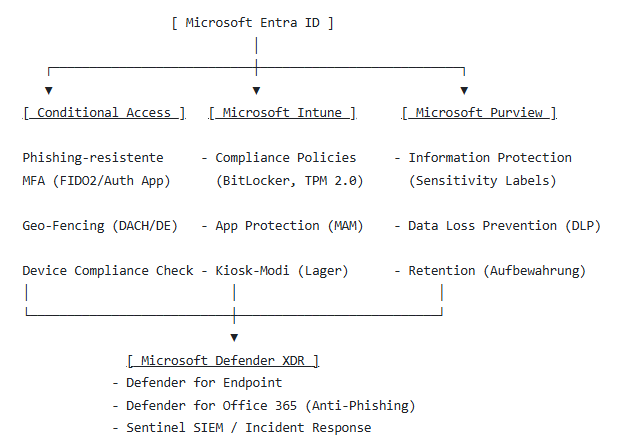

# Enterprise Cloud Security & ISMS Architecture (ISO/IEC 27001:2022 & DSGVO)
**Organisation:** SKY-Rhein Logistik GmbH  
**Standort:** Düsseldorf (HQ), Köln (Disposition), Duisburg (Hub), Mobil (Flotte)  
**Infrastruktur:** 100% Cloud-Native (Microsoft 365 E5, Entra ID, Microsoft Intune, Defender XDR, Purview)  
**Rolle / Autor:** S. Kaya (IT-Security Admin)

---

## 🏢 1. Unternehmensprofil & Geschäftskontext (Klausel 4.1 & 4.2)
Die **SKY-Rhein Logistik GmbH** ist ein mittelständisches Logistikunternehmen mit **85 Mitarbeitern**, das zeitkritische Just-in-Time (JIT) Lieferketten für führende Automotive-OEMs steuert:
* **Verwaltung & Disposition (35 Mitarbeiter):** Düsseldorf (Zentrale) & Köln (JIT-Planung). Nutzung von mandantengemanagten Windows 11 Enterprise Geräten.
* **Operative Logistik & Flotte (50 Mitarbeiter):** Duisburg (Umschlaglager) & Flotte (Transport). Nutzung von MDM-verwalteten Android/iOS-Geräten und robusten IoT-Scannern.

### Kritische Geschäftsrisiken (Business Impact)
* **Produktionsstillstand (Line-Stop):** Ein Ausfall der JIT-Routenplanung verursacht vertragliche Regresskosten von bis zu **50.000 € pro Stunde**.
* **RTO / RPO Ziele:** Recovery Time Objective (RTO) < 2 Stunden; Recovery Point Objective (RPO) < 15 Minuten.
* **Gesetzliche & Regulatorische Anforderungen:** Einhaltung der EU-DSGVO (Art. 32), NIS2-Richtlinie (Meldepflicht < 24 Stunden an das BSI) und TISAX/ISO 27001 Konformität.

---

## 🏛️ 2. Architekturüberblick (Zero Trust & Cloud-Native)
Das System verzichtet vollständig auf lokale Legacy-Infrastrukturen und basiert auf dem **Microsoft Zero Trust Framework** ("Never Trust, Always Verify"):



---
## ⚙️ 3. Spezifische Sicherheits- und Regulierungs-Integrationen
Neben den Standard-Sicherheitskontrollen wurden drei dedizierte Architektur-Mechanismen für den Logistiksektor implementiert:

BSI / BfDI Notfall-Eskalation (Control 5.5 & 5.6): Direkte Einbindung der behördlichen Meldewege des Bundesamtes für Sicherheit in der Informationstechnik (BSI) in Purview- und Defender-Alarmierungsvorlagen für meldepflichtige Sicherheitsvorfälle (< 24 Std. gemäß NIS2).

Physische & Digitale Korrelation (Control 7.2 & 7.4): Korrelation physischer Zutrittsprotokolle des Lagers Duisburg mit Microsoft Sentinel SIEM zur automatisierten Erkennung von Impossible Travel und unberechtigten Zugriffen.

Sichere B2B-Lieferantenintegration (Control 5.19 & 5.20): Granulare Zugriffsbeschränkung externer Flottentelematik- und IT-Partner über Microsoft Entra External ID (B2B Collaboration) mit erzwungenem Conditional Access.

## 📋 4. ISO/IEC 27001:2022 & Microsoft Mapping Matrix

| ISO 27001 Klausel / Control | Norm-Anforderung | Technische Implementierung (M365 Portal) | Technischer Nachweis (Evidence) |
| :--- | :--- | :--- | :--- |
| **Klausel 4.1, 4.2 & 4.3** | Kontext, Stakeholder & Geltungsbereich | M365 Admin Center: Organization Profile, Unified Audit Log Ingestion | `Org-Settings.json`, Tenant-Audit Status |
| **Klausel 5.3 / Control 5.3** | Funktionstrennung (Segregation of Duties) | Entra Privileged Identity Management (PIM): Rollenaktivierung mit Genehmigungsworkflow | `PIM-Approval-Audit.csv`, RBAC Schema |
| **Control 5.12 & 5.13** | Klassifizierung & Kennzeichnung von Daten | Purview Information Protection: Vertraulichkeitsbezeichnungen & automatische Verschlüsselung | `Sensitivity-Labels.json`, DLP-Policy Export |
| **Control 5.17 & 8.5** | Authentifizierungsinformationen & Zugriff | Entra ID Conditional Access: Geoblocking, Smart Lockout & Banned Password Liste | `CA-Policy-MFA.json`, Sign-in Logs |
| **Control 5.19 & 5.20** | Informationssicherheit in Lieferantenbeziehungen | Entra B2B External Identities: Gast-Restriktionen & dedizierte Zugriffspakete | `B2B-Access-Policy.json` |
| **Control 6.3** | Sensibilisierung & Schulung | Defender for Office 365: Phishing-Simulation & automatische Zuweisung von Trainings | `Phishing-Campaign-Report.pdf` |
| **Control 7.7** | Sauberer Schreibtisch & Bildschirm | Intune Configuration Profiles: Inaktivitäts-Sperre (< 5 Min.), USB-Port-Restriktion | `Device-Configuration-Win11.json` |
| **Control 8.1 & 8.24** | Benutzer-Endgeräte & Kryptographie | Intune Compliance Policy: TPM 2.0, Secure Boot, BitLocker XTS-AES-256 | `Intune-Compliance-Report.csv` |
| **Control 8.12** | Vermeidung von Datenlecks (DLP) | Purview DLP: Blockierung von Übertragungen von Kundendaten (IBAN, DSGVO PII) via E-Mail/USB | `Purview-DLP-Rules.json` |
| **Control 8.15 & 8.16** | Protokollierung & Überwachungsaktivitäten | Defender XDR Alert Policies & Unified Audit Logs: Alarmierung bei Rechteausweitung | `Alert-Policies.json`, Incident Logs |
| **Klausel 9.2 & 9.3** | Internes Audit & Managementbewertung | Purview Compliance Manager: ISO 27001 Assessment Score & Audit Evidence Pack | `Compliance-Score-Evidence.pdf` |

## 📂 5. Repository-Struktur
```
sky-rhein-isms-cloud-architecture/
│
├── README.md                           # Zentrales Projektdokument & Architekturbeschreibung
│
├── 01-governance-iso27001/             # Offizielle ISMS-Richtlinien, Scope, Rollen & Protokolle
│   ├── ISMS-SCP-001-Scope.md           # Klausel 4.3: Geltungsbereich (Düsseldorf, Köln, Duisburg, Flotte)
│   ├── ISMS-STK-001-Stakeholder.md     # Klausel 4.1 & 4.2: Stakeholder-Analyse & Erwartungen
│   ├── ISMS-POL-001-Security-Policy.md # Klausel 5.2: Informationssicherheitsrichtlinie
│   └── ISMS-ORG-Organigramm.md         # Klausel 5.3: Rollenverteilung & Funktionstrennung
│
├── 02-identity-access-sc300/           # Entra ID Konfigurationen & Zero Trust Identitätsmodelle
│   ├── groups-and-rbac/                # Gruppen-Struktur (de-leitung, de-disposition, de-lager, de-fahrer)
│   ├── conditional-access/             # Richtlinien für MFA, Geoblocking & Device Compliance
│   └── pim-configuration/              # Just-In-Time (JIT) Rollenaktivierung & Genehmigungsworkflows
│
├── 03-endpoint-security-md102/         # Intune Endgerätesicherheit für Windows 11 & Mobile Devices
│   ├── compliance-policies/            # BitLocker, Secure Boot, TPM 2.0 & OS-Minimalversionen
│   ├── configuration-profiles/         # Clean-Screen-Sperren & Peripherie-Restriktionen
│   └── app-protection-mam/             # Schutz von Unternehmensdaten auf Mobilgeräten (DLP/MAM)
│
├── 04-information-protection-sc401/    # Purview Datenklassifizierung & DSGVO-Schutzmaßnahmen
│   ├── sensitivity-labels/             # Vertraulichkeitsstufen (Öffentlich bis Streng Vertraulich)
│   ├── dlp-policies/                   # Schutz kritischer Finanz- und Personendaten
│   └── retention-policies/             # Gesetzliche Aufbewahrungsfristen (GoBD / DSGVO)
│
├── 05-threat-detection-ms102/          # Defender XDR & Sicherheitsüberwachung
│   ├── risk-assessment/                # Secure Score Analyse & Schwachstellen-Aktionsplan
│   ├── alert-policies/                 # Automatische Vorfall-Alarmierung bei Rechteänderungen
│   └── attack-simulation/              # Phishing-Kampagnen & automatisierte Schulungszuweisung
│
└── 06-audit-evidence-pack/             # Audit-Nachweise für interne und externe Auditoren
    ├── purview-compliance-report.pdf   # ISO 27001 Compliance Manager Scorecard
    └── technical-screenshots/          # Bildnachweise für aktive Richtlinien und Logs
```


## 🛠️ 6. Verwendete Technologien & Automatisierung
Cloud Portale: Microsoft 365 Admin Center, Entra Admin Center, Intune Admin Center, Defender XDR Portal, Purview Compliance Portal.

Automatisierung & Scripting: PowerShell 7, Microsoft Graph PowerShell SDK (Microsoft.Graph.Users, Microsoft.Graph.Groups, Microsoft.Graph.Identity.DirectoryManagement), ExchangeOnlineManagement.

Standards & Frameworks: ISO/IEC 27001:2022, ISO/IEC 27002:2022, EU-DSGVO (GDPR), BSI IT-Grundschutz, NIS2-Richtlinie.
